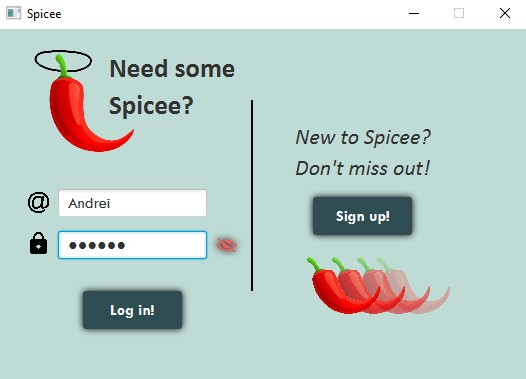
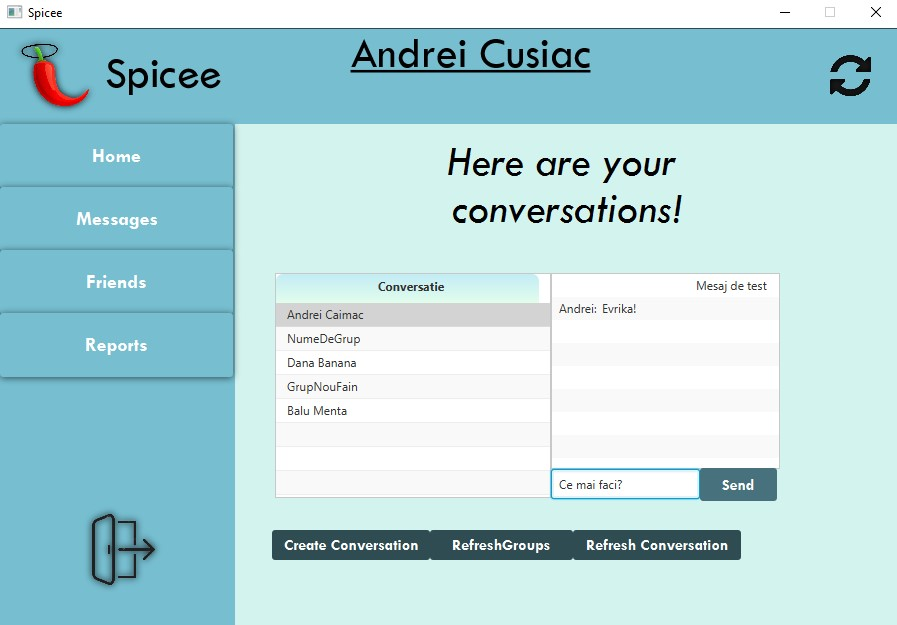

# Spicee
A social platform mock-up 

Made as a project for my university in collaboration with my colleague Andrei Comăniciu.

The app is actually a client that resembles a rudimentary social media platform that allows you to befriend other users and send messages to them.

When you open the app, you are greeted by the log-in form:

After a successful log-in, the main page pops up. 

Here you can see your friends and all your received friendship requests.

Choosing ”Messages” from the side menu brings you the messages panel, where you can open a chat with one of your friends.

You can also create groups where multiple people can send and receive messages.

